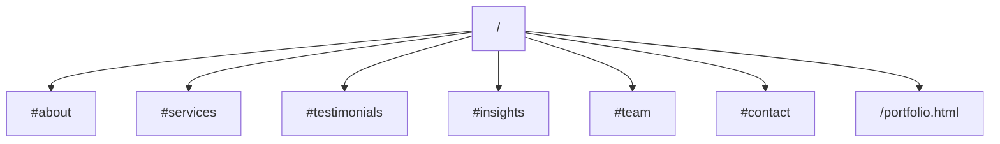
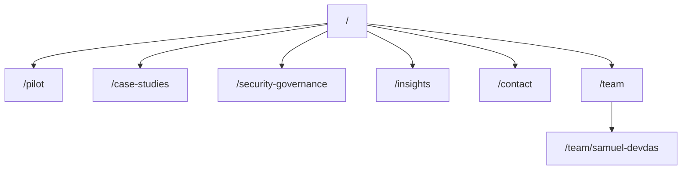
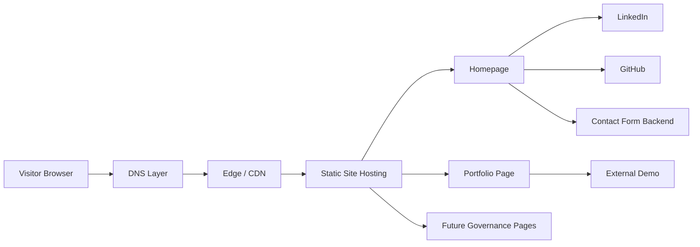

# Comprehensive Design and Architectural Review of TruVine Insights

## Executive summary

The site presents a credible early-stage AI consulting practice with a strong production-oriented message. The positioning around production LLM systems, secure delivery, and Swiss enterprise relevance is directionally strong.

The current website structure is still closer to a founder-led brochure site than a board-ready enterprise services site. It communicates capability, but it does not yet package governance, pilot structure, procurement readiness, or proof in a way that larger buyers expect.

The strongest parts of the current experience are:

- clear production-AI positioning
- straightforward navigation
- visible testimonials and founder credibility
- practical technical language instead of hype
- lightweight site structure that should be easy to improve

The weakest parts are:

- limited information architecture depth
- no visible privacy or governance pages
- founder CV content mixed into the company buying journey
- no productized pilot offer
- no on-site insights library
- weak board-level CTA framing

A key domain note emerged during the review. The requested spelling was `truvineinsights.ch`, but the live indexed site observed during the audit was `www.truevineinsights.ch`. This should be normalized across brand, repo, and documentation so there is no ambiguity.

## Scope note

This review is based on the currently observed live site and public-facing materials. Some low-level infrastructure details such as response headers, DNS records, and TLS specifics were not fully available during the audit and are therefore marked as unspecified where relevant.

## Site structure and content inventory

### Observed structure

The site is effectively composed of:

- a homepage with anchor-based navigation
- a separate founder portfolio page
- supporting static pages and assets

The homepage currently carries too much weight. It attempts to handle company positioning, services, testimonials, founder trust, insights, and contact in one pass.

### Current sitemap

| URL | Role | Notes |
|---|---|---|
| `/` | Homepage | Main business positioning and conversion page |
| `/portfolio.html` | Founder portfolio | Detailed founder profile, technical stack, experience, and project proof |
| `/robots.txt` | Crawl control | Not fully verified during audit |
| `/sitemap.xml` | Crawl discovery | Not fully verified during audit |

### In-page navigation map

## Architectural assessment

### Information architecture

The current structure is easy to understand, but it is too shallow for a consulting business that wants to sell governed AI delivery to serious buyers.

What works:

- simple navigation
- low friction path to contact
- clear hero-to-contact narrative

What does not work:

- no dedicated pilot page
- no dedicated case studies page
- no dedicated governance or security page
- no dedicated privacy page
- no owned insights section with real articles
- founder portfolio sits too close to commercial site navigation

### Recommendation

Move from a brochure structure to a light but purposeful service architecture:

- `Home`
- `Pilot`
- `Case Studies`
- `Security & Governance`
- `Insights`
- `Contact`
- optional `Team` page
- move founder portfolio into a secondary path or clearly separate section

### Recommended future sitemap

## Messaging and positioning review

### What is strong

The phraseology around production LLM systems is a strong differentiator. The site is not overrun with vague AI language. It signals delivery, integration, evaluation, and operational seriousness.

That matters because many AI consulting sites still read like experimentation shops. This one already points toward implementation.

### What is weak

The site currently mixes two narratives:

- enterprise buyer narrative
- founder availability and personal portfolio narrative

That creates friction. A serious buyer wants to understand:

- what you deliver
- how you de-risk it
- what engagement starts small
- how success is measured
- how governance is handled

They do not primarily want to evaluate hiring-style details during the first pass.

### Core message gap

The biggest content gap is not capability. It is packaging.

The site needs a clear answer to:

**What is the smallest safe engagement a buyer can approve to prove value?**

Right now that answer is implied, but not spelled out.

## UX and conversion review

### Current UX strengths

- anchor navigation is easy to use
- page hierarchy is understandable
- founder trust is visible
- site feels lightweight and not bloated

### Current UX weaknesses

- CTA language is too generic for senior buyers
- conversion path is too founder-centric
- proof is not structured into buying artifacts
- insights section is underdeveloped
- the portfolio page can pull attention away from the core commercial path

### CTA review

Current CTA framing such as “Book a Free Consultation” is acceptable for early traction, but it under-signals seriousness for enterprise and regulated buyers.

Recommended replacement:

- primary CTA: `Book a 30-minute board briefing`
- secondary CTA: `Request pilot brief (PDF)`

That wording better matches the level of risk, budget, and decision-making implied by the rest of the service language.

## Trust, governance, and compliance review

### Visible strengths

The visible messaging suggests a mature delivery mindset:

- private-cloud orientation
- evaluation and regression emphasis
- secure delivery language
- production framing

### Trust gaps

The site does not yet surface the trust artifacts buyers expect:

- privacy notice
- contact form data handling notice
- security and governance page
- retention and access-control posture
- procurement-friendly engagement outline
- references available under NDA

### Why this matters

For enterprise AI work, trust is not built by saying “secure.” It is built by showing the operating assumptions and boundaries.

Even a concise governance page would materially improve perceived maturity.

## Technical architecture review

### Likely current state

The site appears to be lightweight and static. That is an advantage. It should be relatively easy to maintain and improve without major platform overhead.

### Benefits of the current approach

- low operational complexity
- fast iteration for content changes
- simpler performance baseline
- easier governance for a small site

### Risks and gaps

- technical SEO foundations need verification
- custom domain consistency must be made explicit
- security headers should be checked and hardened
- sitemap and robots should be confirmed
- analytics and event measurement should be added in a privacy-conscious way

### Reference architecture

## SEO and discoverability review

### Strengths

- clear business category language
- Swiss enterprise context is present
- technical topical relevance is real
- brand naming is distinctive

### Weaknesses

- very limited content depth
- insights are not owned on-site
- case studies are not packaged as search assets
- sitemap status needs confirmation
- structured data is not visibly part of the strategy yet

### Main SEO conclusion

The site can rank better, but only if it stops being mostly a single-page brochure and starts publishing owned content around the actual service edge:

- governed pilots
- evaluation for LLM systems
- private-cloud AI delivery
- RAG operations
- measurable ROI in enterprise AI

## Priority recommendations

| Priority | Effort | Recommendation | Why it matters |
|---|---:|---|---|
| High | 0.5 to 1 day | Normalize domain naming across site, repo, and docs | Removes immediate trust friction |
| High | 1 to 2 days | Publish privacy notice and form data handling note | Baseline buyer and compliance trust |
| High | 1 to 2 days | Add Security & Governance page | Makes maturity visible |
| High | 1 to 2 days | Add dedicated Pilot page | Turns capability into a buyable first step |
| High | 2 to 4 days | Separate founder CV from core commercial path | Improves enterprise positioning |
| High | 0.5 to 1 day | Confirm sitemap, robots, and domain settings | Technical hygiene |
| Medium | 1 to 2 days | Add structured data for organization/local business | Better entity clarity |
| Medium | 2 to 4 days | Replace coming-soon insights with real on-site content | SEO and trust growth |
| Medium | 0.5 to 1 day | Reframe CTA to board-briefing language | Better conversion fit |
| Low | 1 day | Replace metaphor-first imagery with proof-first visual strip | Faster category recognition |
| Low | 0.5 to 1 day | Add legal footer with business identity details | Better procurement readiness |

## Suggested 4 to 6 week action sprint

### Week 1

Clarify the company story and site architecture.

Deliverables:

- domain naming decision
- revised sitemap
- page outline for Home, Pilot, Case Studies, Governance, Insights, Contact
- decision on whether portfolio remains public and where

### Week 2

Build trust primitives.

Deliverables:

- privacy notice
- contact-form data notice
- security and governance page draft
- footer legal trust block

### Week 3

Productize the offer.

Deliverables:

- 4 to 6 week pilot page
- KPI and deliverables section
- board briefing CTA
- request pilot brief CTA

### Week 4

Harden technical and SEO basics.

Deliverables:

- sitemap verification
- robots verification
- structured data implementation
- header and domain hygiene check
- analytics event plan

### Week 5 to 6

Add proof and publishing rhythm.

Deliverables:

- 2 anonymized case studies
- 3 on-site insights articles
- measurement baseline for CTA clicks and contact submissions

## Proposed above-the-fold direction

### Headline

Practical AI that boards approve.

### Proof line

4–6 week pilot to measurable operational KPI and governance checklist.

### CTA stack

- `Book a 30-minute board briefing`
- `Request pilot brief (PDF)`

## Next steps for implementation

1. Merge this document into the repo as the planning baseline.
2. Convert the recommendations into issues grouped by:
   - IA
   - content
   - trust and governance
   - technical hygiene
   - conversion
3. Implement the high-priority trust and pilot pages first.
4. Rework homepage CTA and proof structure.
5. Publish on-site insights and case studies.

## Suggested follow-up issues

### Content

- Rewrite hero and CTA for board-level buyers
- Draft pilot page copy
- Draft governance page copy
- Draft privacy page
- Draft two anonymized case studies

### Technical

- Verify domain, DNS, and canonical setup
- Add sitemap.xml and confirm robots.txt
- Add organization structured data
- Audit security headers
- Add privacy-conscious analytics events

### Design

- Simplify proof hierarchy above the fold
- Reduce founder-CV prominence on commercial path
- Add proof strip with outcomes, sectors, and delivery model
- Create reusable page template for insights and case studies

## Final assessment

The current site is credible, capable, and much stronger than many early AI consulting sites in its language and intent.

Its next leap is not a visual redesign alone. It is a shift from a compact founder brochure into a small, procurement-aware, governance-literate consulting site that makes the first engagement easy to approve.

That is a very achievable next step.
